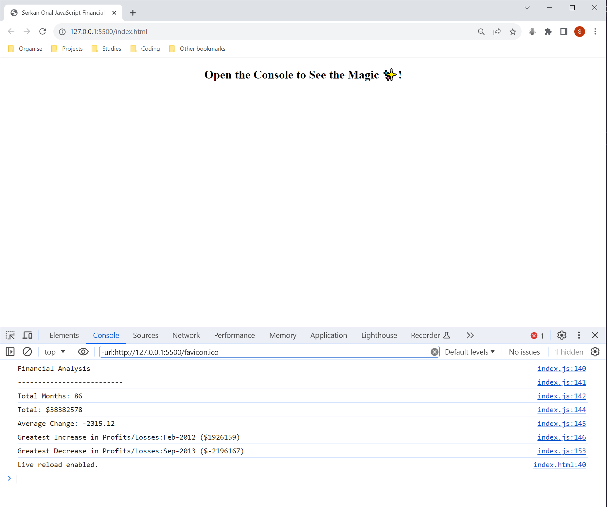

# Serkan Onal JavaScript Financial Console Project

## Description

This first JavaScript project was created in order to show my ability to work with JavaScript code, EDX provided the starter code to which i had to add and improve to make this into a functional financial calculator.

As my first JavaScript assignment i had to use what had been taught/ provided by EDX in the first week to code a financial calculator.

Prior to adding any of my own code i was provided with a dataset with an array with two fields of data, a date and profit/ losses.

The financial calculator which i was tasked to code is to be used to analyze the records and to calculate the follow:

- The total number of months included in the dataset.
- The net total amount of Profit/Losses over the entire period.
- The average of the changes in Profit/Losses over the entire period.
- The greatest increase in Profit/Losses (date and amount) over the entire period.
- The greatest decrease in Profit/Losses (date and amount) over the entire period.

Once all the required analyses are done, these should be outputted to the console with the figures.

 Some considerations beforehand and during the development. 

- ***Clean and consistant Code*** -Clean code with useful naming conventions.
- ***Code Reusablitiy*** - Provide code which is DRY, reusing existing code to form new functions.
- ***Responsive Design*** -Research on how to achieve specific functions or tasks using what has been taught as far from EDX.
- ***Plan Code*** - Think about what will be required ahead of coding, plan what variables, methods and concepts to adopt in code before writting any code.
 
 

- **What was the motivation for this project**
    
  I wanted to show my case ability to understand working with JavaScript.

  I wanted to use what was taught from in introduction in JavaScript from EDX and adapt those teachings into this project and try gain further understanding of JavaScript and how it can be used within real world projects.

  I wanted to use this project to gauge my understand of JavaScript so that i would be able to identify areas which will require improvement.
   
   
- **Why was this project built**
  &nbsp;&nbsp;&nbsp;&nbsp;&nbsp;&nbsp;
  1. To allow people/ employers the ability view my understanding of JavaScript.
   
  1. To demonstrate my ability using JavaScript however limited the teaching has been.
   
  1. To gauge my understanding of JavaScript to identify areas for improvement for further projects in the future.
 

- **The problems that where solved in this project**
 
 1. The ability to understand and use JavaScript, working with new concepts within the JavaScript language.  
 2. Using variables, arrays, if statements, if-else statements and for-loops to obtain and extraction information to provide a useful output.
 3. To take information from a data set and manlipulate with methods to output information that is useful for finanical analyses.

- What did you learn? 
  
  1. I leant how to declare variables, setup arrays, use loops and if-statements to output useful information.
    
  1. Using Pseudocode to help break down a task into smaller segments.
    
  1. Pair programming and how working with another developer can help gain a new prospective on tasks/ methods.
  
## Table of Contents

- [Serkan Onal JavaScript Financial Console Project](#serkan-onal-javascript-financial-console-project)
  - [Description](#description)
  - [Table of Contents](#table-of-contents)
  - [Installation](#installation)
  - [Live Site](#live-site)
  - [Serkan Onal JavaScript Financial Console Project and Source code on Github](#serkan-onal-javascript-financial-console-project-and-source-code-on-github)
  - [Usage](#usage)
  - [Credits](#credits)
  - [License](#license)

## Installation

**Using Git to create a copy/ clone of website.**

1. Open either Git Bash (Windows) or Terminal (MacOS) and the following commands to create a copy of the website.
   
2. Create a folder/ directory to store website folders/ files within it use the following command 
  &nbsp;&nbsp;&nbsp;&nbsp;&nbsp;&nbsp; -
 ` mkdir "folder name"` 

1.  Navgate into folder using following command. 
  &nbsp;&nbsp;&nbsp;&nbsp;&nbsp;&nbsp; -
  `cd "folder name"` 

1. To make a copy/ clone of the website inside of the folder/ directory use the following command 
  &nbsp;&nbsp;&nbsp;&nbsp;&nbsp;&nbsp; -
  `git clone git@github.com:serk03/Console-Finances.git`
  
1. Navigate inside of your folder/ directory that you copied using the following commands. 
&nbsp;&nbsp;&nbsp;&nbsp;&nbsp;&nbsp; -
  `cd "folder/ directory name"`

1. To view the folder/ files from the website inside a VS Code using the following command. 
&nbsp;&nbsp;&nbsp;&nbsp;&nbsp;&nbsp; -
  `code .`

1. Open the files you would like to view using the following command. 
&nbsp;&nbsp;&nbsp;&nbsp;&nbsp;&nbsp; 
  -index.html - right and select open with default browser, will open the website in your default browser.
   
&nbsp;&nbsp;&nbsp;&nbsp;&nbsp;&nbsp; 
 -Double click on either index.html/ index.js to view code that has been used to create website structure (index.html) and javascript (index.js).

 

## Live Site
- To view the live/ active website please click on the following link: [View Live Serkan Onal JavaScript Financial Console Project](https://serk03.github.io/Console-Finances/)

## Serkan Onal JavaScript Financial Console Project and Source code on Github
- To view the repository and its source code please visit Github by clicking on the following link: [View Github Repository](https://github.com/serk03/Console-Finances)

## Usage

Provide instructions and examples for use. Include screenshots as needed.

**Console Out**
  - Doubled click on index.html file from the cloned repository.
  - Once the browser has opened up right click on the page and navigate to the "Inspect" option, this will open the "Inspect" console.
  - Click on the "Console" tab  from the "Inspect" menu, then you will be able to see the financial Analysis output.
 
&nbsp;&nbsp;&nbsp;&nbsp;&nbsp;&nbsp; 

**VS CODE**
- To view the source code of the JavaScript open the cloned repo folder in your choosen code editor and doubled click on the index.js from the JS folder.

## Credits

Author of Project - Serkan Onal

Assistance/ Collaboration and pair programming on this project was provided by Tudor Tocan during tutoring session.

## License

No Licenses where used or applied to this website.

